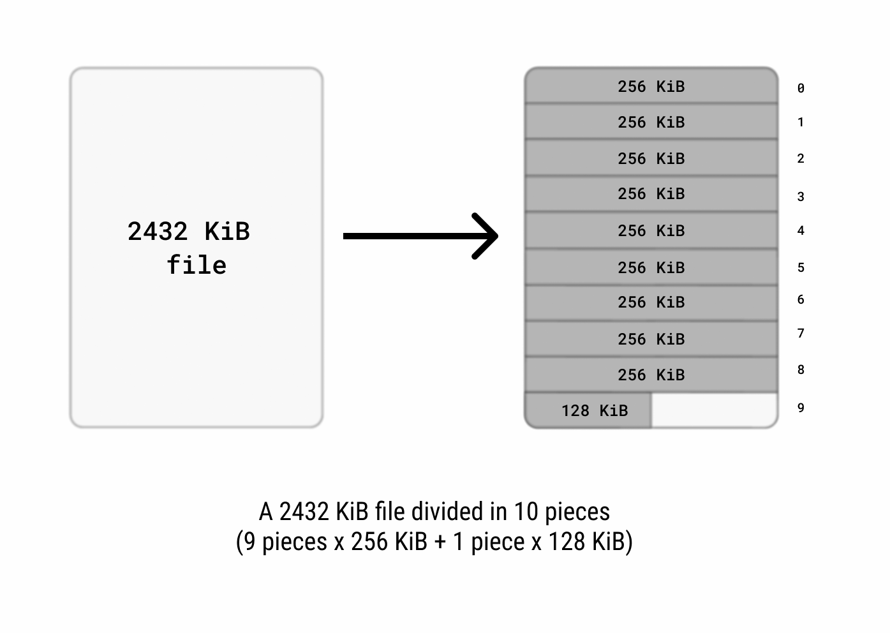
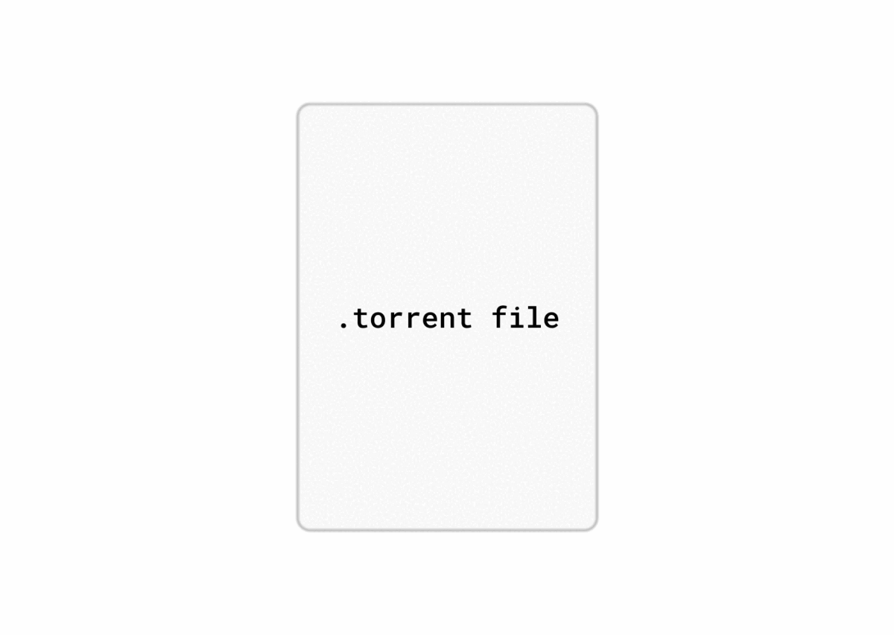
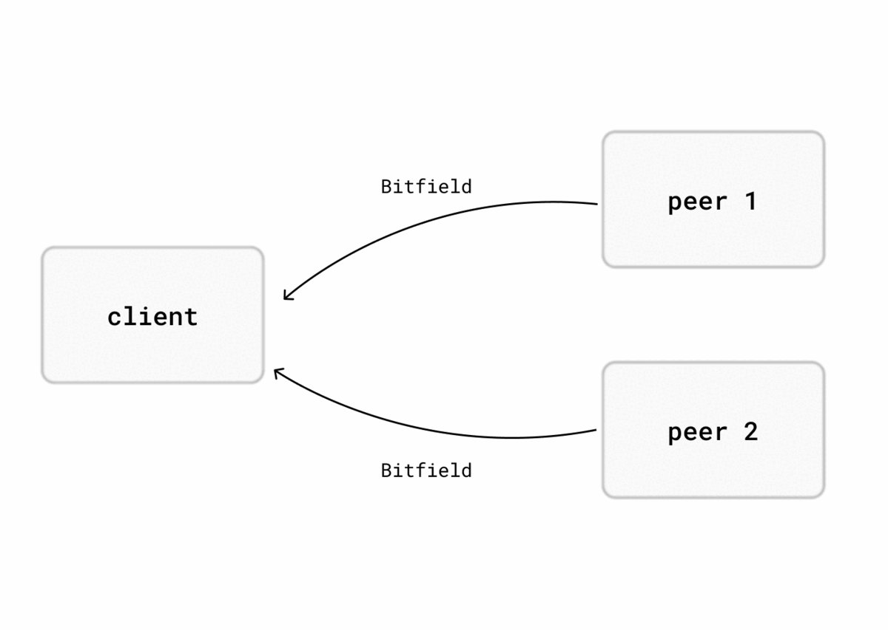

# BitTorrent v1.0 overview and client PoC with Rust

This repository was built for educational purposes, for myself and anyone else who might be interested on this topic.  
It aims at providing an easy-to-follow overview of the BitTorrent protocol and a PoC implementation of a BitTorrent
client built using async Rust.  
For a list of features not yet supported by the client, but that might get implemented in the future, check out
the [link here issues page].

## Table of contents

1. [The BitTorrent protocol](#1-the-bittorrent-protocol)  
   1.1. [BitTorrent's purpose](#11-bittorrents-purpose)  
   1.2. [Metafiles](#12-metafiles)  
   1.3. [Trackers](#13-trackers)  
   1.4. [Entering the BitTorrent network](#14-entering-the-bittorrent-network)  
   1.5. [Types of peers](#15-types-of-peers)  
   1.6. [The choking mechanism](#16-the-choking-mechanism)  
   1.7. [Exchanging data in the BitTorrent network](#17-exchanging-data-in-the-bittorrent-network)  
   1.8. [Piece picking](#18-piece-picking)
2. [BitTorrent Client PoC with Async Rust](#2-bittorrent-client-poc-with-async-rust)  
   2.1. [Architecture](#21-architecture)  
   2.2. [Choking mechanism implementation](#22-choking-mechanism-implementation)  
   2.3. [Piece picker implementation](#23-piece-picking-implementation)

## 1. The BitTorrent protocol

The following sections provide a high-level overview of BitTorrent v1.0.  
After reading them, I also recommend checking out both the [unofficial](https://wiki.theory.org/BitTorrentSpecification)
and the [official](http://bittorrent.org/beps/bep_0003.html) BitTorrent v1.0 specifications.

### 1.1. BitTorrent's purpose

Consider the scenario in which a large file has to be shared to a lot of people.
A common approach would be set up a server which has the entire file and have all the people
download the file from it. This would put a lot of pressure on your server.  
BitTorrent aims to solve this issue, by using a peer-to-peer approach. In this case, the need for a central server that
uploads all the data is removed, because everyone engaged in the transfer will be able to both upload and download data
to and from other peers.

### 1.2. Metafiles

Before diving into metafiles, it is important to understand that, when a file is shared through BitTorrent,
it gets divided in equal parts called _pieces_.

To share a file with BitTorrent, a `.torrent` metafile is created, containing various information about the shared data,
such as:

- the names and sizes of the shared files
- the piece length
- the Sha1 hash of each piece
- one or more tracker URLs

Using the metafile, we can also compute the torrent's _info hash_, by performing a Sha1 on a specific field of the
metafile. The _info hash_ serves as a unique identifier of the torrent.  
`.torrent` files are text files, and they use a simple encoding called _bencode_.
In the bencode format, there are 4 types of data, as illustrated in the table below:

| Data Type    | Encoding Template | Encoded Example    | Unencoded Representation |
|--------------|-------------------|--------------------|--------------------------|
| Strings      | `<length>:<data>` | `7:torrent`        | `torrent`                |
| Integers     | `i<integer>e`     | `i210e`            | `210`                    |
| Lists        | `l<contents>e`    | `li210e7:torrente` | `[123, "torrent"]`       |
| Dictionaries | `d<contents>e`    | `d1:ai2e1:b3:sthe` | `{"a": 2, "b": "sth"}`   |

### 1.3. Trackers
Trackers are the only central authorities in this protocol, making BitTorrent v1.0 a hybrid P2P system. Simply put, trackers
are HTTP services which keep track of who is currently transferring the shared files.  
BitTorrent clients contact the tracker:
- when trying to enter the network, receiving back a list of peers to exchange data with
- regularly, during the download, at every "interval" seconds, where "interval" is specified by the tracker on the first request;
the purpose of these requests is to help the tracker keep different metrics about the torrent(like, how many bytes each
peer has uploaded/downloaded)
- when exiting the network

### 1.4. Entering the BitTorrent network

For a BitTorrent client to access a BitTorrent network, it will have to: 
- parse the `.torrent` metafile and retrieve the tracker URL and the torrent's info hash
- contact the tracker, using the specified URL and the info hash, to retrieve some peers 
that are currently transferring the torrent
- try to establish a TCP connection with each peer and perform a BitTorrent handshake

The handshake is performed by both peers sending each other a message which contains the info hash of the torrent, 
a peer id, and the string identifier of the BitTorrent protocol.  
Once the handshake is complete, the client can start exchanging data with the peer.

### 1.5. Types of peers

The BitTorrent network is made up of:
- seeders = peers which have the entire torrent and only upload to others
- leechers = peers which may have some pieces of the torrent; they download and maybe upload from/to others

### 1.6. The choking mechanism
In a BitTorrent network, if peer A is choking peer B, it means that peer A is refusing to upload data to peer B.  
If peer A is not choking peer B, then peer A is willing to upload data that peer B requests.  

The choking mechanism exists for a few different reasons.  

First, if you communicate with a lot of peers(say 50+, which is common for popular torrents), you would quickly use
all your bandwidth.  

Then, there's the matter of equitable exchanges.   
If you are a leecher, you can choose to unchoke only the peers that are also uploading data back to you. 
If there are many peers doing this, you can unchoke only the ones that give you the best download rate.  
If you are a seeder, you can unchoke only the peers which give you the best upload rate. This way, you ensure 
that pieces get downloaded by the peers as fast as possible, thus making the entire swarm get the data faster.  
At regular intervals, peers will change who they choke and unchoke.  

By following the rather simple rule of leechers unchoking only the peers who give the most data in exchange, 
free riders(i.e. peers who only download, without uploading anything) get automatically penalized.  

There is one final concept which ties the entire choking mechanism together, and that is the optimistic unchoke. 
At regular intervals, BitTorrent clients unchoke a peer at random. This can help the client find faster connections, and 
it is also very helpful for peers who just joined the network and have no pieces.

### 1.7. Exchanging data in the BitTorrent network
The peers communicate with each other via the following set of specific messages:

**A. Bitfield**  
A bitfield is a data structure which represents the pieces owned by a peer.  
It is very compact, and it represents each piece using a single bit: 
0, if the piece is _not_ owned by the peer, and 1 if the piece is owned by the peer. The high bit 
represents the piece with the index 0.  

For example, let's consider a torrent with 5 pieces. Since computers work with bytes, not bits, the bitfield will have 
8 bits, and the first 5 will represent the owned pieces. If a peer sends this: 10011000, we can say that the peer owns
pieces 0, 3 and 4, and is missing pieces 1 and 2.  

The Bitfield message is the first message sent by the peers after the handshake is complete, and does not need to be sent 
if the peer has no pieces at all. 

**B. Have**  
A Have message signals that a peer owns a piece. 

**C. Interested**  
This message is sent when the client wants to download a piece from another peer.  
For example, if the client is missing piece 3, and a peer has piece 3(signaled through Bitfield and Have messages), then 
the client will send this message to the peer.

**D. Not Interested**  
The opposite of the Interested message, sent when the client is no longer interested in the peer.

**E. Unchoke**  
When a client receives this message from a peer, it means that the peer is no longer choking the client.

**F. Choke**
When a client receives this message from a peer, it means that the peer is now choking the client.

**G. Request**  
This is the message used to actually request data from another peer. 

It is important to note that peers do not transfer entire pieces from one another. Instead, they exchange "blocks". 
A block is a subdivision of a piece, and it is usually 16 KiB. According to the [unofficial](https://wiki.theory.org/BitTorrentSpecification)
BitTorrent specification, almost all clients will drop the connection if they receive a request for a block larger than 16 KiB.  
Blocks are identified using:
- the piece index that they are a part of 
- the offset in the piece, in bytes
- the length of the block

**H. Piece**  
This message is the response to the Request message, containing the requested block.

**I. Cancel**  
This message is used to cancel a Request message.

### 1.8. Piece picking
BitTorrent clients use different strategies to decide the order in which to download the missing pieces.  
A good and common strategy is to pick the rarest pieces in the swarm first. If a client is exchanging data with 
multiple peers, and only of those peers has piece 5, it is a good idea to download that piece first. Firstly, it is 
a good idea because, if that peer leaves, the download cannot complete. Secondly, because rare pieces are not good for 
the overall download speed of the swarm.

## 2. BitTorrent Client PoC with Async Rust

### 2.1. Architecture

### 2.2. Choking mechanism implementation

### 2.3. Piece picking implementation

